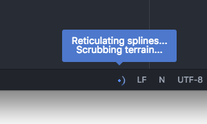

# Busy Signal

A small status bar icon to indicate that something's happening.



[Code Formatting](./code-format.md) and [Find References](./find-references.md)
automatically activate the busy signal while they're waiting for providers,
but any package can consume the busy signal service.

## Service API

Consume the busy signal [Atom service](http://flight-manual.atom.io/behind-atom/sections/interacting-with-other-packages-via-services/) by adding this to your `package.json`:

```
"consumedServices": {
  "atom-ide-busy-signal": {
    "versions": {
      "0.1.0": "consumeBusySignal"
    }
  }
}
```

Then, in your package entry point, add:

```
export function consumeBusySignal(busySignalService) {
  ...
}
```

`busySignalService` will be a `BusySignalService` object
as described in [`atom-ide-busy-signal/lib/types.js`](../modules/atom-ide-ui/pkg/atom-ide-busy-signal/lib/types.js).
