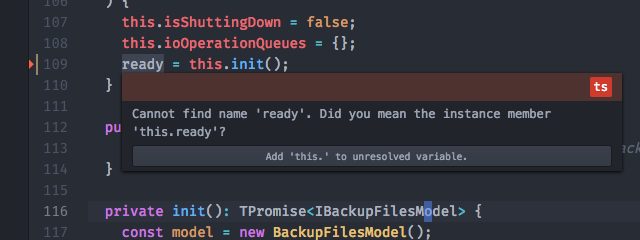
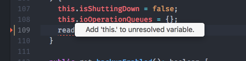

# Code Actions

Code Actions allow you to perform additional actions for [diagnostics](
./diagnostics.md).

Code Actions can currently be triggered in two ways.

One, by mousing over a diagnostic with code actions:



Or, by using the `diagnostics:show-actions-at-position` command / keyboard shortcut
while the cursor is on top of a diagnostic with code actions.



## Service API

Provide the code actions [Atom service](http://flight-manual.atom.io/behind-atom/sections/interacting-with-other-packages-via-services/) by adding this to your `package.json`:

```
"providedServices": {
  "code-actions": {
    "versions": {
      "0.1.0": "provideCodeActions"
    }
  }
}
```

Then, in your package entry point, add:

```
export function provideCodeActions(): CodeActionProvider {
  return ...
}
```

You must return a `CodeActionProvider` object
as described in [`atom-ide-code-actions/lib/types.js`](../modules/atom-ide-ui/pkg/atom-ide-code-actions/lib/types.js).

- `grammarScopes` should be a list of [scope names](
https://github.com/execjosh/atom-file-types#scope-names) of grammars
that the provider should apply to.
- `priority` will be used to determine the ordering of code actions in the case
of multiple providers.
- `getCodeActions` will be called in the situations described above, with a list
of intersecting diagnostics. See screenshots above to see how actions are displayed in the UI.

Once the user clicks an action, your `apply()` function will be called.
