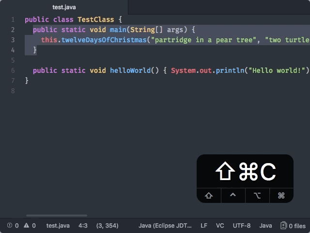

# Code Format

Format a selection of code using the `code-format:format-code` command.  
(Also accessible via context menu, or "Edit > Text > Format Code").

When no selection is provided, the entire file is formatted.



Code Format also provides APIs to:

- format code as you type
- format code on save (after you press save but before writing to disk).

You can enable format-on-save using plain range/file providers from the
"atom-ide-code-format" section in the `atom-ide-ui` package settings.

## Service API

Provide code format [Atom services](http://flight-manual.atom.io/behind-atom/sections/interacting-with-other-packages-via-services/) by adding one or more of these to your `package.json`:  
(Only the ones that you want to use; you don't need all of them!)

```
"providedServices": {
  "code-format.range": {
    "versions": {
      "0.1.0": "provideRangeCodeFormat"
    }
  },
  "code-format.file": {
    "versions": {
      "0.1.0": "provideFileCodeFormat"
    }
  },
  "code-format.onType": {
    "versions": {
      "0.1.0": "provideOnTypeCodeFormat"
    }
  },
  "code-format.onSave": {
    "versions": {
      "0.1.0": "provideOnSaveCodeFormat"
    }
  }
}
```

Then, in your package entry point:

```
export function provideRangeCodeFormat(): RangeCodeFormatProvider {}
export function provideFileCodeFormat(): FileCodeFormatProvider {}
export function provideOnTypeCodeFormat(): OnTypeCodeFormatProvider {}
export function provideOnSaveCodeFormat(): OnSaveCodeFormatProvider {}
```

The various provider types are described in
[`atom-ide-code-format/lib/types.js`](../modules/atom-ide-ui/pkg/atom-ide-code-format/lib/types.js).
