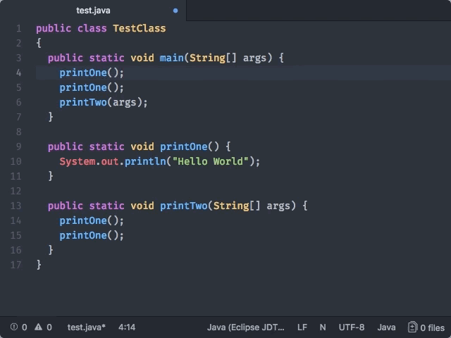

# Code Highlight

Put your cursor on a symbol to see relevant ranges highlighted.



## Service API

Provide the code highlight [Atom service](http://flight-manual.atom.io/behind-atom/sections/interacting-with-other-packages-via-services/) by adding this to your `package.json`:

```
"providedServices": {
  "code-highlight": {
    "versions": {
      "0.1.0": "provideCodeHighlight"
    }
  }
}
```

Then, in your package entry point, add:

```
export function provideCodeHighlight(): CodeHighlightProvider {}
```

You must return a `CodeHighlightProvider` object
as described in [`atom-ide-code-highlight/lib/types.js`](../modules/atom-ide-ui/pkg/atom-ide-code-highlight/lib/types.js).

- `grammarScopes` should be a list of [scope names](
https://github.com/execjosh/atom-file-types#scope-names) of grammars
that the provider should apply to.
- `priority` will be used to determine the provider to use in the case of multiple providers.
- `highlight` will be called every time the cursor position changes or the buffer changes with the current position.
The returned array of ranges will be highlighted.
