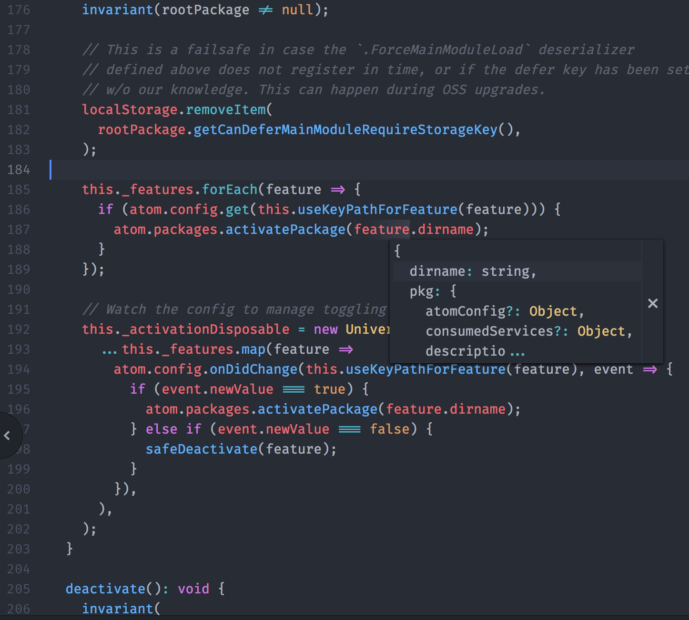

# Datatips

Hover over sections of code to see relevant information in a tooltip.

Datatips can display one or more blocks of Markdown-formatted text or
highlighted snippets of code.

## Service API

TODO
