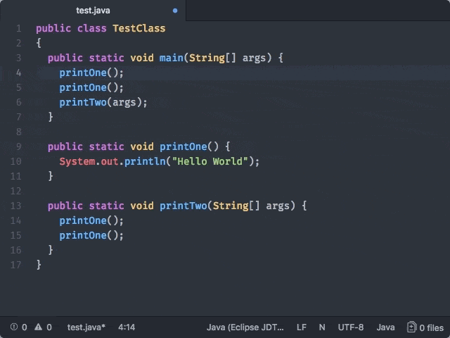

# Datatips

Hover over sections of code to see relevant information in a tooltip.



Datatips can display one or more blocks of Markdown-formatted text or
highlighted snippets of code.

Datatips can be pinned to be persistent using the small 'pin' button.

## Service API

Consume the datatip [Atom service](http://flight-manual.atom.io/behind-atom/sections/interacting-with-other-packages-via-services/) by adding this to your `package.json`:

```
"consumedServices": {
  "datatip": {
    "versions": {
      "0.1.0": "consumeDatatipService"
    }
  }
}
```

Then, in your package entry point, add:

```
export function consumeDatatipService(datatipService) {}
```

`datatipService` will be a `DatatipService` object
as described in [`atom-ide-datatip/lib/types.js`](../modules/atom-ide-ui/pkg/atom-ide-datatip/lib/types.js).

Use the `DatatipService` to register providers with `addProvider`.
`addModifierProvider` may be used to register
datatips that require trigger keys: one example
is definition previews, which appear when using
the [Hyperclick](./definitions.md) modifier key.

For each provider:

- `grammarScopes` should be a list of [scope names](
https://github.com/execjosh/atom-file-types#scope-names) of grammars
that the provider should apply to.
- `priority` will be used to disambiguate between multiple providers. The highest priority provider that returns a non-null result will be displayed.
- Return a valid `Datatip` object from the `datatip` function.
Using the `MarkedString` form is preferred to avoid having to create a custom React component.

Finally, `createPinnedDataTip` may be used to dynamically create
pinned datatips at any time.
