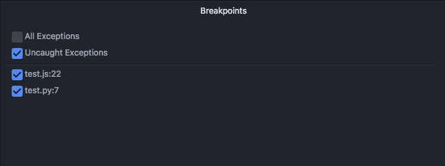
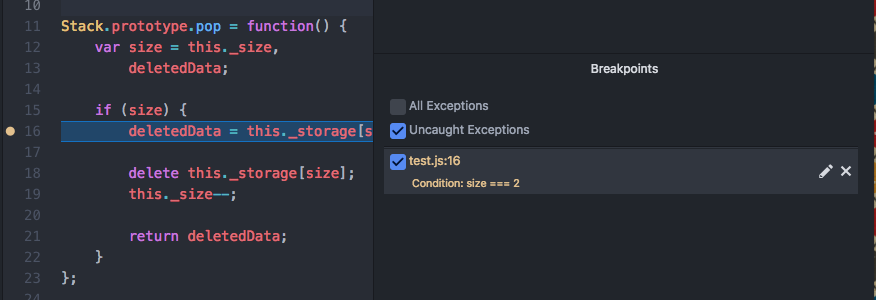

# Breakpoints
Clicking the line gutter would toggle (adding/removing) breakpoints.

Then as the program is running, if a line on which a breakpoint is set is hit, the program halts, and you're able to perform debugging tasks such as step and evaluation from that point.

## Breakpoint list

Breakpoints can be enabled/disabled by toggling the checkbox. Right-clicking in the area will give you the option to quickly remove, enable, or disable all breakpoints at once.

Clicking on a breakpoint in this list will navigate to its source line of code.

## Exception Breakpoints

Debug adapters may return a number of exception breakpoints that'd be represented in the UI to toggle (& persist between debug sessions).

## Conditional Breakpoints

For debugger engines that support it, breakpoints can have conditions:

