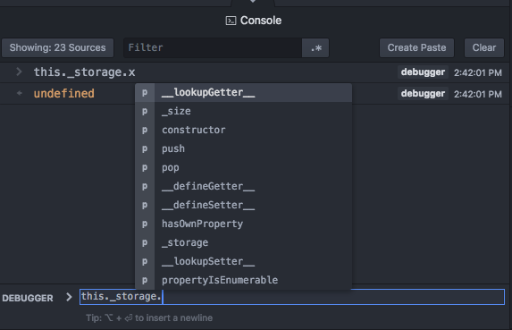

# Debugger Console

The Debugger supports REPL via the `Console` tab that:

* Streams output of the debugee process.
* Allows evaluation of expressions, call functions and use the current state of the program when stopped.

It also provides autocomplete (if the debugger engine provides it).

