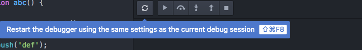

# Debugger Controls

Once debugging is started, these controls allows stepping & restart of the debugging session.

See [Keybindings](https://github.com/facebook-atom/atom-ide-ui/blob/master/docs/keybindings.md) for keyboard access to controls.
