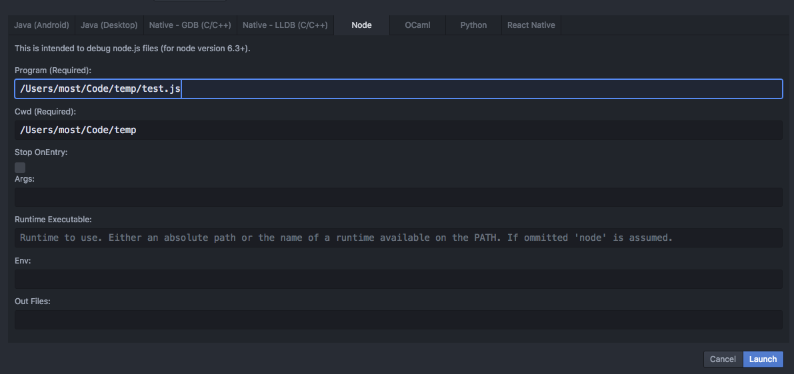

# Debugger: Launch / Attach UI

Use the `debugger:show-launch-dialog` or `debugger:show-attach-dialog` commands to launch or attach your debugger with the needed options.

Launch/Attach options will be persisted through multiple debug sessions and various debuggers in `localStorage`.

Debugger integrations' Launch/Attach UI, can be generate - given properties - using:
[`AutoGenLaunchAttachProvider`](https://github.com/facebook/nuclide/blob/master/modules/atom-ide-debugger-node/main.js).

After clicking `Launch`/`Attach`, the debugging session is started & users may step, pause, restart ..etc.
