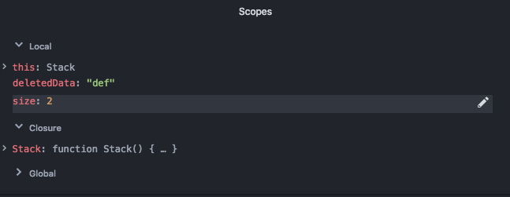
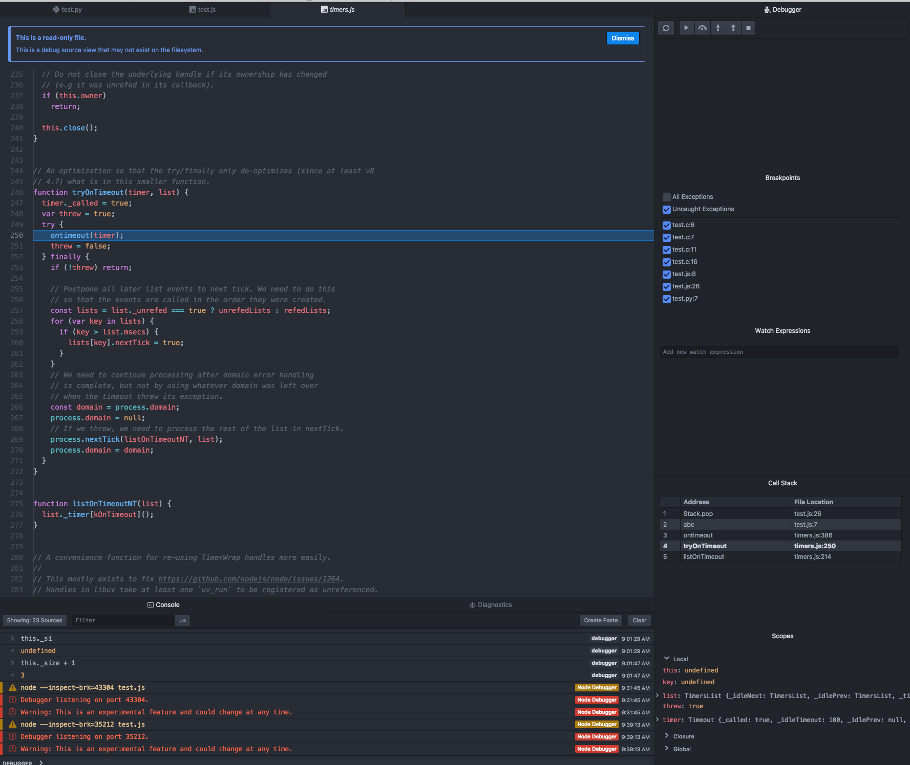

# Scopes

The Scopes view shows information about variables based upon the current point in the running of the code.

Which scopes are visible depends on the language being debugged.

## Editing variables

If the debugger engine supports it, variables can be edited inline using an edit icon.

