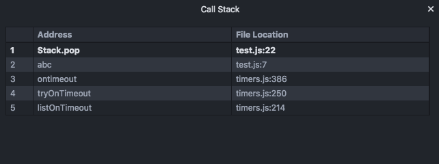

# Call Stack

Show the top 20 stack frames: address, location and line numbers, allowing navigation between stack frames & has the ability to load more stack frames.

Stack frames with no source available are greyed out & non-clickable.

## In-memory source views

If there's an in-memory source available for a stack frame (but no filesystem representation) - e.g. Node's internal APIs - `timers.js` - or C++ assembly views, the debugger would show a read-only version of the source code.

