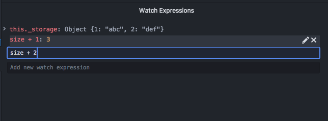

# Watch Expressions

You may add watch expressions to keep track of the values of custom expressions that'd be re-evaluated on stepping to reflect the latest value.

Expressions can be added/edited/removed quickly using the controls:

