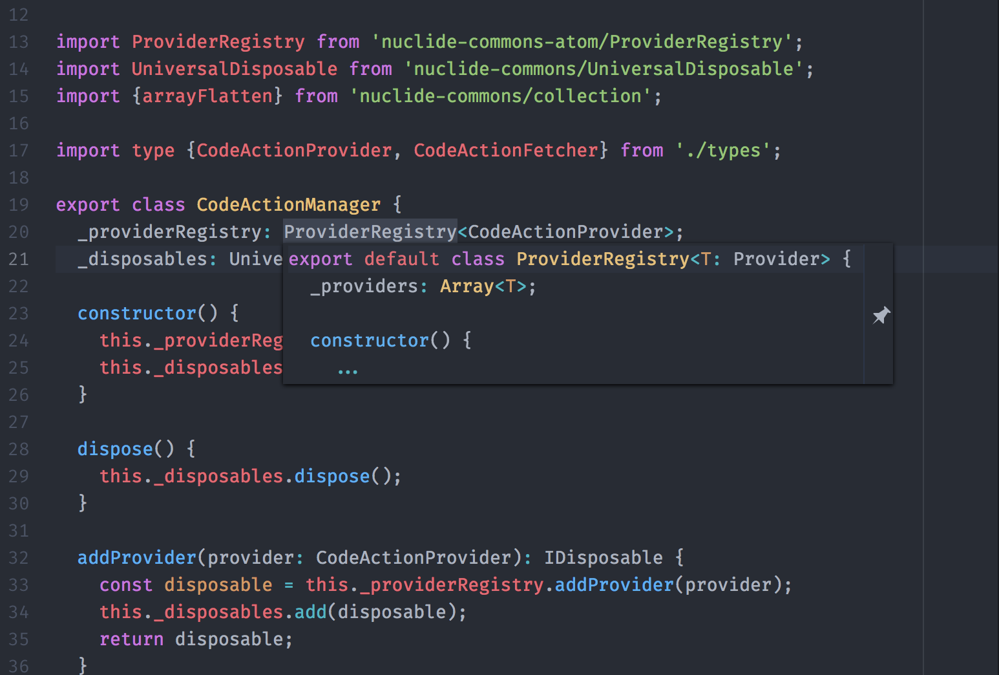

# Definitions

## Hyperclick

Cmd-click (Ctrl-click on Windows/Linux) on an editor position to go to its
definition, or trigger the `hyperclick:confirm-cursor` command.


## Definition Preview

Cmd-hover (Ctrl-hover on Windows/Linux) on an editor position to preview the
source code following the definition.



## Service API

Atom IDE UI consumes an abstract "definitions" API to fetch definitions at
arbitrary editor positions. If you use this API, Hyperclick and Definition Preview are automatically
provided for you.

You can provide the definitions [Atom service](http://flight-manual.atom.io/behind-atom/sections/interacting-with-other-packages-via-services/) by adding the following to your `package.json`:

```
"providedServices": {
  "definitions": {
    "versions": {
      "0.1.0": "provideDefinitions"
    }
  }
}
```

Then, in your package entry point, add:

```
export function provideDefinitions(definitionProvider) {}
```

`definitionProvider` must be a `DefinitionProvider` object
as defined in
[`atom-ide-definitions/lib/types.js`](../modules/atom-ide-ui/pkg/atom-ide-definitions/lib/types.js).

- `grammarScopes` should be a list of [scope names](
https://github.com/execjosh/atom-file-types#scope-names) of grammars
that the provider should apply to.
- `priority` will be used to disambiguate between multiple providers. The highest priority provider that returns a non-null result will be used.

## Hyperclick Service API

In some cases, it may make sense to provide Hyperclick results directly.  
In general, Hyperclick results can perform arbitrary actions upon selection (unlike definitions, which can only take you to a file location).

To provide Hyperclick results, add the following to your `package.json`:

```
"providedServices": {
  "hyperclick": {
    "versions": {
      "0.1.0": "provideHyperclick"
    }
  }
}
```

Then, in your package entry point, add:

```
export function provideHyperclick(hyperclickProvider) {}
```

`hyperclickProvider` should be a `HyperclickProvider` object as defined in
[`hyperclick/lib/types.js`](../modules/atom-ide-ui/pkg/hyperclick/lib/types.js).
