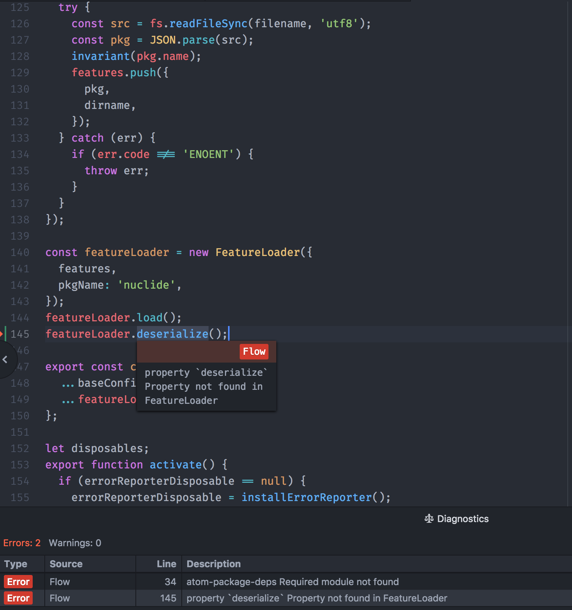

# Diagnostics

## Overview

Atom IDE UI displays diagnostics in three main ways:

- An expandable dock shows a table of diagnostics
- Diagnostics are underlined inside the text editor (with [datatips](./datatips.md))
- Color-coded gutter markers indicate the presence of diagnostics on a line

## Service APIs

Atom IDE UI is compatible with the [Linter APIs](http://steelbrain.me/linter/),
with a few unimplemented features:

- markdown rendering of `description`
- the `url` and `icon` fields
- multiple `solutions` (only the first one is used)
- callback-based `solutions`
- callback-based `description`
