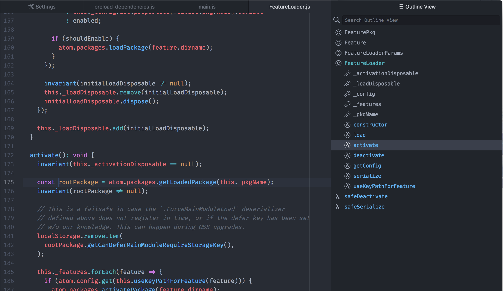

# Outline View

Use the `outline-view:toggle` command to open the Outline View dock.



The Outline View displays a tree view of all symbols in the active editor,
along with the ability to filter on a search keyword and jump to selected symbols.

You can also select the editor range corresponding to an outline view entry by
simply double-clicking it.

## Service API

You can provide the Outline View [Atom service](http://flight-manual.atom.io/behind-atom/sections/interacting-with-other-packages-via-services/) by adding the following to your `package.json`:

```
"providedServices": {
  "outline-view": {
    "versions": {
      "0.1.0": "provideOutlines"
    }
  }
}
```

Then, in your package entry point, add:

```
export function provideOutlines(): OutlineProvider {
  return ...
}
```

The return value must be a `OutlineProvider` object
as defined in
[`atom-ide-outline-view/lib/types.js`](../modules/atom-ide-ui/pkg/atom-ide-outline-view/lib/types.js).

Outlines are normally re-fetched after every edit, but
you can provide an `updateOnEdit` field of `false` to only re-fetch on save.
