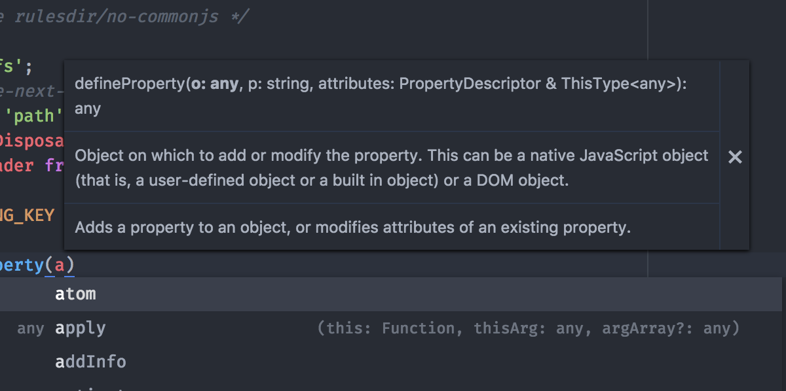

# Signature Help (WIP)

This is a work-in-progress UI for the LSP's [`textDocument/signatureHelp`](
https://github.com/Microsoft/language-server-protocol/blob/master/protocol.md#textDocument_signatureHelp).



Signature help can be triggered in two ways:

1. By typing a character contained in `triggerCharacters` from a provider
for the current editor's grammar scope.
2. By manually activating the `signature-help:view` Atom command.

Once activated, all signature help providers (matching the current grammar scope)
will continuously be queried for signatures when the cursor location changes,
regardless of the value of `triggerCharacters`.

Signatures will be displayed in a small [datatip](./datatips.md) above the current
cursor until all providers return a null or empty signature for a cursor location,
at which point signature help will become deactivated until triggered again.

## Service API

You can consume the signature help [Atom service](http://flight-manual.atom.io/behind-atom/sections/interacting-with-other-packages-via-services/)
by adding the following to your `package.json`:

```
"consumedServices": {
  "signature-help": {
    "versions": {
      "0.1.0": "consumeSignatureHelp"
    }
  }
}
```

Then, in your package entry point, add:

```
export function consumeSignatureHelp(registry: SignatureHelpRegistry): IDisposable {
  return ...
}
```

`registry` will be a function to be called with a single argument:
a `SignatureHelpProvider` object as described in
[`atom-ide-signature-help/lib/types.js`](
../modules/atom-ide-ui/pkg/atom-ide-signature-help/lib/types.js).
